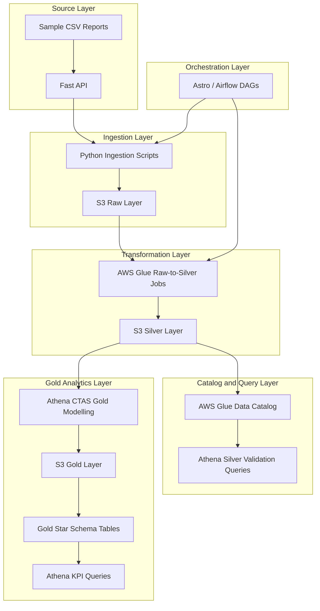

## Architecture

The project follows a layered mobile app analytics data platform architecture. Data is simulated from local CSV reports through a FastAPI mock API, ingested into Amazon S3 raw storage, transformed using AWS Glue, cataloged for Athena, and modelled into a gold-layer star schema.

