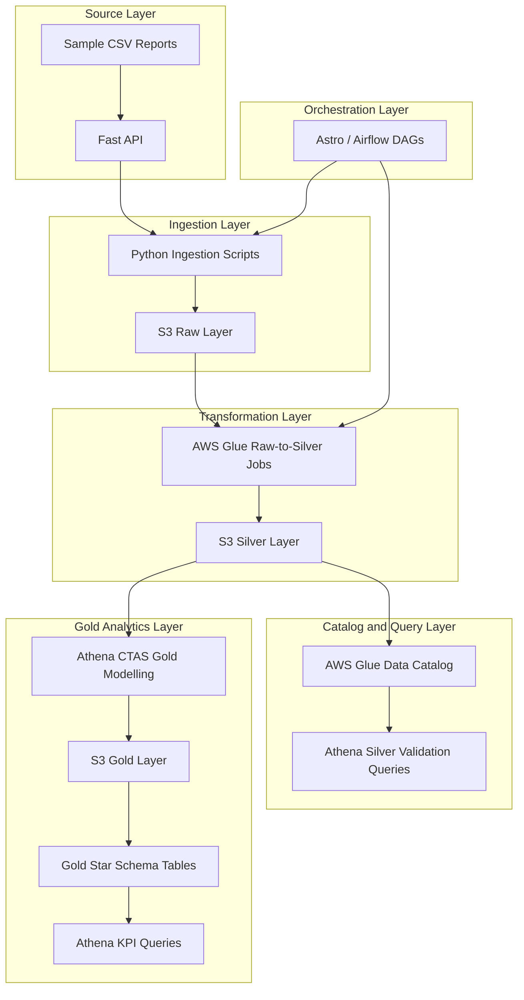

# Mobile App Analytics Data Platform

## 1. Project Overview

This project is an end-to-end mobile app analytics data engineering pipeline built on AWS.

It simulates the ingestion, transformation, orchestration, cataloging, querying, and modelling of Apple App Store and Google Play reports across three business domains:

1. Revenue
2. App Performance
3. Subscriptions

## 2. Business Objective

Mobile app businesses receive multiple reporting files from Apple and Google. These reports contain revenue, subscription, install, and crash metrics, but they arrive in different structures and from different source systems.

The objective of this project is to build a data platform that:

- Ingests Apple and Google report data
- Stores original source files in a raw S3 layer
- Transforms source-specific files into clean silver datasets
- Catalogs datasets for SQL access through Athena
- Orchestrates the workflow using Airflow
- Builds a gold-layer dimensional model for business analytics

##  3. Architecture

The project follows a layered mobile app analytics data platform architecture. Data is simulated from local CSV reports through a FastAPI mock API, ingested into Amazon S3 raw storage, transformed using AWS Glue, cataloged for Athena, and modelled into a gold-layer star schema.

##  4. Technology stack

Source simulation             Fast API
Ingestion	                  Python, requests, boto3
Storage	                      Amazon S3
Transformation	              AWS Glue, PySpark
Catalog	                      AWS Glue Data Catalog
Query engine	              Amazon Athena
Orchestration	              Apache Airflow using Astro CLI
File format	                  CSV in raw, Parquet in silver/gold
Data modelling	              Star schema gold layer

##  5. Data Domains

The project covers three business domains.

Revenue

Revenue reports include:

Google estimated sales
Google earnings
Apple sales
Apple finance

These are transformed into standardized revenue silver datasets and later modelled into fact_revenue.

App Performance

App performance reports include:

Google installs
Google crashes
Apple installs
Apple crashes

These are transformed into standardized app performance silver datasets and later modelled into fact_app_performance.

Subscriptions

Subscription reports include:

Google subscriptions
Apple subscriptions

These are transformed into standardized subscription silver datasets and later modelled into fact_subscriptions.

## 6. Data Lake Layers

The project follows a layered data lake pattern.

Raw Layer

The raw layer stores source files exactly as ingested from the mock APIs.

Example paths:

raw/revenue/apple/finance/report_month=2026-03/
raw/revenue/google/earnings/report_month=202604/
raw/app_performance/apple/installs/report_month=202604/
raw/subscriptions/google/subscriptions/report_month=202604/
Silver Layer

The silver layer stores cleaned and standardized Parquet datasets.

Silver datasets include normalized columns such as:

source_system
report_type
app_id
app_name
country_code
year
month
revenue metrics
app performance metrics
subscription metrics

Example paths:

silver/revenue/
silver/app_performance/
silver/subscriptions/
Gold Layer

The gold layer contains business-friendly star-schema tables.

Example paths:

gold/dim_source_system/
gold/dim_report_type/
gold/dim_country/
gold/dim_app/
gold/dim_product/
gold/dim_date/

gold/fact_revenue/
gold/fact_app_performance/
gold/fact_subscriptions/

## 7. Ingestion Layer

The ingestion layer uses Python scripts to call mock API endpoints and upload the returned CSV files to S3 raw.

Example flow:

FastAPI endpoint
→ Python ingestion script
→ boto3 upload
→ S3 raw path

Example ingestion script behavior:

Calls a mock API endpoint
Downloads the CSV response
Uploads the CSV into the raw S3 layer
Logs the S3 destination path

The mock API is used to simulate external Apple and Google reporting APIs.

## 8. Transformation Layer

AWS Glue jobs transform raw CSV data into standardized silver Parquet datasets.

Each Glue job:

Reads raw data from S3
Validates required columns
Checks the dataset is not empty
Standardizes column names
Adds metadata columns such as source system and report type
Writes cleaned Parquet files to the silver layer

Shared utility functions are used for:

required column validation
empty dataset validation
raw path construction
silver path construction

## 9. Orchestration Layer

Airflow is used to orchestrate the end-to-end pipelines.

The project includes separate DAGs for each business domain:

dag_revenue_pipeline
dag_app_performance_pipeline
dag_subscriptions_pipeline

Each DAG follows this pattern:

start
→ ingestion task
→ Glue raw-to-silver task
→ end

The ingestion tasks run Python ingestion scripts.
The Glue tasks trigger AWS Glue jobs and wait for completion.

Astro CLI is used to run Airflow locally in Docker.

## 10. Data Catalog and Athena

AWS Glue Data Catalog stores metadata for silver and gold datasets.

Athena is used to:

query silver datasets
validate pipeline outputs
create gold tables using CTAS
run KPI queries against the star schema

A separate Athena database is used for the gold layer:

mobile_app_analytics_gold

## 11. Gold Layer Data Model

The gold layer uses a dimensional star schema.

The model contains three fact tables and six shared dimensions.

Dimension Tables
dim_source_system
dim_report_type
dim_country
dim_app
dim_product
dim_date
Fact Tables
fact_revenue
fact_app_performance
fact_subscriptions